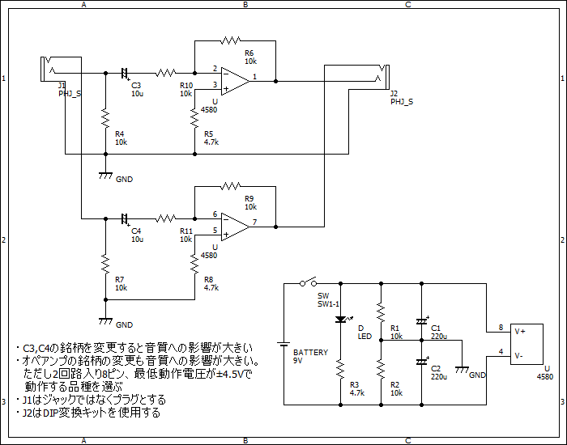
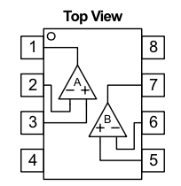
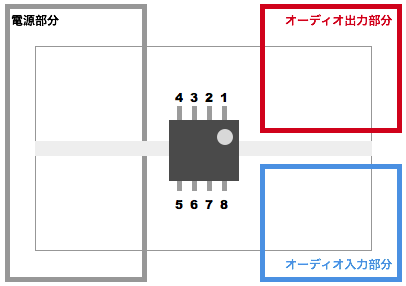

TODO
----
* 各部毎に写真を入れる
* オーディオ入力部のJ1写真
* オーディオ入力部の動作確認
* オーディオ出力部のJ2写真
* オーディオ出力部の動作確認
* トラブルシューティング

ブレッドボードで作る簡易ヘッドホンアンプ
=======================================

** これはあくまでも簡易のヘッドホン作成キットであす。実用性よりも学習に重きをおいたキットであり、十分な効果を保証するものではありませんのでご注意ください。**

これはブレッドボード上に作る簡易ヘッドホンアンプです。
オペアンプで増幅回路を作ります。
電源には9Vの電池を使います。

キット内容
----------

| 名称                            | 個数など |
|---------------------------------|----------|
| ブレッドボード                  | 1        |
| ヘッドホンのケース              | 1        |
| 電池 006P 9V                    | 1        |
| スイッチ + 電池スナップ         | 1        |
| DIP化キット                     | 1        |
| ステレオミニプラグ + シールド線 | 1        |
| オペアンプ NJM4580              | 1        |
| 抵抗 10k                        | 8        |
| 抵抗 4.7k                       | 3        |
| コンデンサ10uF                  | 2        |
| コンデンサ220uF                 | 2        |
| リード線                        | 適量     |
| LED 緑                          | 1        |

### 回路図

### オペアンプ

データシート: http://semicon.njr.co.jp/jpn/PDF/NJM4580_J.pdf

組み立てに必要なもの
-------------------

リード線の被覆を向くための道具が必要です。

参考）

* ワイヤーストリッパー
* ラジオペンチ
* ニッパー
* 動作確認が用のイヤフォン

また、**テスター** があれば上手くいかない時の動作確認ができます。

組み立て手順
------------

### 0. レイアウトの決定

| 名称                    | 個数など |
|-------------------------|----------|
| ブレッドボード          | 1        |
| オペアンプ NJM4580      | 1        |

付属のブレッドボードは大変小さいため、上手に配置しないと配線することができません。
最初におおまかなレイアウトを決めます。以下のようにオペアンプが中心に来るように配置します。この時、オペアンプの向きに注意してください。

### 1. 電源部

| 記号  | 名称                    |
|-------|-------------------------|
| BT    | 電池 006P 9V            |
| SW    | スイッチ + 電池スナップ |
| OP    | オペアンプ NJM4580      |
| R1,R2 | 抵抗 10k                |
| R3    | 抵抗 4.7k               |
| C1,C2 | コンデンサ220uF         |
| LED   | LED 緑                  |

次に電源部分を配線します。

1. SWをレイアウト図の電源部内に接続します。
  * C1,C2とR1, R2, R3およびLEDを接続することを考慮し間隔を開けます。
  * 電源の向きに注意してください
  * SWがOFFであることを確認してください
2. リード線を使いOPの８番ピン(V+) と４番ピン（V−）をSWに接続します。
3. 回路図をよく読み、部品が接続しやすいところにGNDを決めます。
4. OPの８番ピン、R1、GNDを接続します
5. OPの８番ピン、C1、GNDを接続します（向きに注意）
6. OPの４番ピン、R2、GNDを接続します
7. OPの４番ピン、C2、GNDを接続します（向きに注意）
8. OPの８番ピン、LED、R3、OPの４番ピンを接続します

TODO 写真   

#### 動作確認

1. オペアンプを外し電池を接続します
2. スイッチをONにしてLEDが点灯することを確認します
  * 明るい部屋だと見にくいかもしれません
3. スイッチをOFFにして電池を外します

### 2. オーディオ入力部

| 記号    | 名称                            |
|---------|---------------------------------|
| J1      | ステレオミニプラグ + シールド線 |
| OP      | オペアンプ NJM4580              |
| R4, R7  | 抵抗 10k                        |
| R10,R11 | 抵抗 4.7k                       |
| C3,C4   | コンデンサ10uF                  |
|         | リード線                        |

次にオーディオ入力部を配線します。

1. レイアウト図を見て、端の方にJ1を接続します。
  * ケースから出す部分になります
  * J1 のピンは右からJ1-LEFT、J1-RIGHT、J1-GNDになります
    * TODO 写真   
2. J1-LEFT にC3とR10とOPの2番ピンを直列に接続します
3. J1-LEFT、R4、J1-GND を接続します
4. J1-RIGHT にC4とR11とOPの6番ピンを直列に接続します
5. J1-RIGHT、R7、J1-GND を接続します
6. J1-GNDとGNDを接続します

TODO 写真   

#### 動作確認

TODO: テスターで抵抗値を測るくらいかな？

### 3. オーディオ出力部

| 記号           | 名称               |
|----------------|--------------------|
| J2             | DIP変換キット      |
| OP             | オペアンプ NJM4580 |
| R5, R6, R8, R9 | 抵抗 10k           |
|                | リード線           |

次にオーディオ出力部を配線します。

1. レイアウト図を見て、端の方にJ2を接続します。
  * ケースから出す部分になります
  * J2 のピンは右からJ2-LEFT、J2-RIGHT、J2-GNDになります
    * TODO 写真   
2. J2-LEFT とOPの1番ピンを接続します
3. J2-LEFT とOPの2番ピンを接続します
4. OPの3番ピン、R5、J2-GNDを接続します
5. J2-LEFT とOPの７番ピンを接続します
6. J2-LEFT とOPの６番ピンを接続します
7. OPの3番ピン、R5、J2-GNDを接続します
8. J2-GNDとGNDを接続します

TODO 写真   

#### 動作確認

TODO: テスターで抵抗値を測るくらいかな？

### 5. 動作確認

1. 電池を接続します
2. 動作確認用のイヤホンを接続します
3. スイッチをON/OFFし、イヤホンが反応するか確認します
4. スイッチをONにし、抵抗の露出部を指で触ってノイズが乗ることを確認します
  * オペアンプに触れ、熱くなり過ぎていないか確認します **火傷注意**
  * コンデンサに触れ、膨らんでいないか確認します
5. MP3プレーヤーなどを接続し音楽をプレイする

### 6. ケースに収納する

| 名称                            | 個数など |
|---------------------------------|----------|
| ヘッドホンのケース              | 1        |

できあがったアンプをケースに収納します。
スイッチ、オーディオ出力部、オーディオ入力部がケースの穴から出るように設置します。

トラブルシューティング
---------------------

### 雑音がのる

結線時にどこか接触していたり、配線が浮いている可能性があります。一度スイッチをOFFにし、配線を確認してください。

### オペアンプが妙に熱い

配線が間違っている可能性があります。一度スイッチをOFFにし、配線を確認してください。

### 音が小さい

TODO

次のステップ
-----------
 
* コンデンサ C3, C4 の銘柄を変更し音質の変化を体感する
* オペアンプの銘柄を変更し音質の変化を体感する
    * オペアンプは２回路入り８ピン、±4.5V以下で動作するものを選ぶ

各部品の役割
------------

### コンデンサ C3 とR10 ( C4 と R11 )

1. 入力される信号に直流分がある場合にこの成分をカットする。直流分があるとこの分も増幅してしまい、必要なAC成分に影響を与えてしまいます。
2. 不要なAC成分をカット（削除、減衰）させる目的。不要な成分とは例えばオーディオ信号の場合数Hzの低い成分が考えられます。本来、数Hzは人間の耳には聴こえない周波数ですが、スピーカーが不要に振動したり等の不具合を回避させたりします。

### コンデンサ C1 ( C2 )

バイパスコンデンサーと呼ばれます。

1. 電源ラインのノイズを低減させる
2. 電源ラインのインピーダンスを低減させる
3. 電源ラインに供給する電圧を瞬間的に補助する

### 抵抗 R1 ( R2 )

分圧して電圧を浮かせる。

### 抵抗 R6 と R10 (R9 と R11)

回路は反転増幅回路なので、信号の増幅度は R6 と R10 に依存します。入力電圧をVi、出力電圧をVoとすると増幅度は以下の式で求められます。

$$ Vo = - \frac{R6}{R10}Vi $$

参考
----

* オペアンプの基礎　回路例　２電源１段アンプ: http://www.marutsu.co.jp/contents/shop/marutsu/mame/99.html

* パスコンって何？: http://www.aitem-lab.com/tc_yougo1_004(1).html

お問い合わせ
------------

* Gitter ルーム
* サポート用の Twitter アカウント作るかなあ
